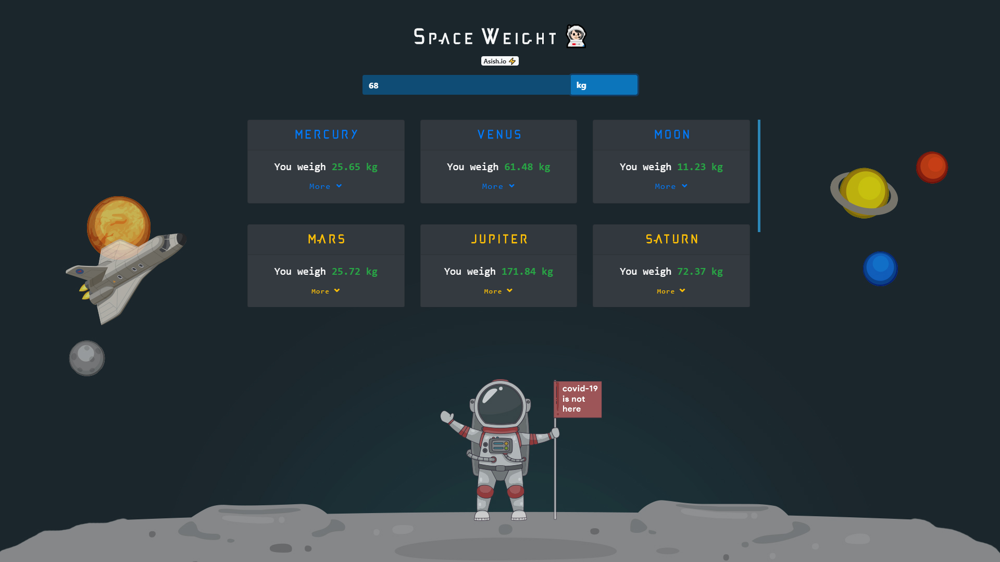

# Space Weight 👨🏻‍🚀
 Know your weight in different planets,if your earth weight haunts you 😁

### Check it out [here]!
 

## Overview 👀

### A fun little web app that tells your weight in diffrent planet if you were ever curious about that

- Uses simple gravitational laws to calculate weight on diffrent planets
- Formula: `weight on any planet = ((your weight on earth/earth gravitaional pull)* that planets gravitaional pull)`
- Example on moon `weight on moon =((67/9.8)*1.62) = 10.24`

## WIP 🛠
- Better UI maybe?😬
- Mobile APP
- Adding more planets /draf planets /stars /moon's  🤔

## How To Contribute🤝 
- Yes,it is open source you can clone and change code to your need.
- Most of the code is self explanatory, anyhow
- for any clarification on code or want to contribute contact 
- [Gmail] / [Twitter] /[LinkedIn]

[Gmail]: <mailto:vashish888@gmail.com>
[LinkedIn]: <https://www.linkedin.com/in/asish-raju-7a0b90192>
[Twitter]: <https://twitter.com/vashish888>
[here]:<https://asishraju.me/Space-Weight/>
